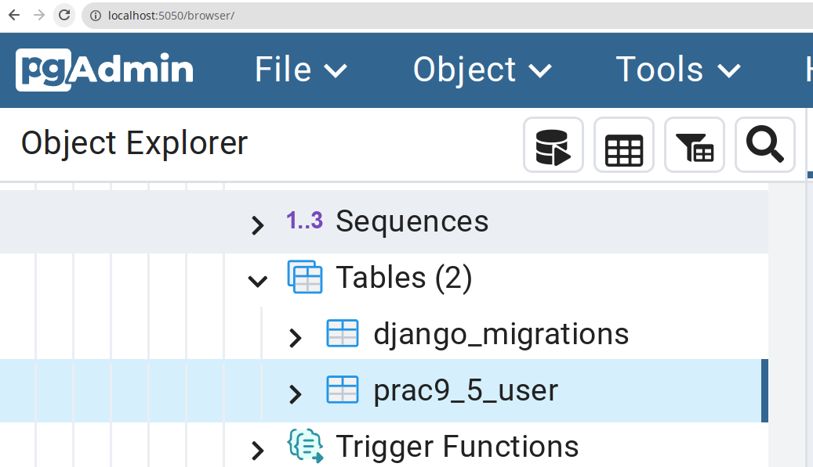

# Python and Web Programming Practicals

<!-- metadata (use pandoc) 
% title: Python and Web Programming Practical 9
% author: Akshar Patel (12102110501003) CSE-IoT Batch As
% date: September 28, 2023
-->

## Installation 
1. Create a virtual environment
```bash
python -m venv env
.\env\Scripts\Activate.ps1
```

2. Install from requirements.txt
```bash
pip install -r requirements.txt
```

## Practical 9.1

## 1. Introduction to MVC Framework:

MVC (Model-View-Controller) is a design pattern commonly used in web development to separate an application into three interconnected components to enhance modularity and maintainability. Here's a brief
overview of each component:
1. Model: The model represents the application's data and business logic. It interacts with the database to retrieve, store, and manipulate data. It is responsible for data storage, retrieval, and manipulation.
2. View: The view is responsible for presenting the data to the user. It handles the presentation layer and rendering of content. It doesn't contain business logic but rather displays data provided by the model.
3. Controller: The controller acts as an intermediary between the model and view. It receives user input from the view, processes it, and interacts with the model to retrieve or update data. The controller also updates the view to reflect changes in the model.

## 2. Django Installation and Server Configuration:

### 2.1. Creating a virtual environment

```bash
python -m venv env   
.\env\Scripts\Activate.ps1
```

### 2.2. Creating a project

```bash
mkdir apps
pip install Django
python manage.py migrate
python manage.py runserver
```

### 2.3. Creating an app inside a folder

```bash
mkdir apps/prac9_1
django-admin startapp prac9_1 apps/prac9_1
```

- Now our project structure looks like this:

```bash
Mode                 LastWriteTime         Length Name
----                 -------------         ------ ----
d-----        28-09-2023  12:35 AM                apps
d-----        28-09-2023  12:26 AM                env
d-----        28-09-2023  12:31 AM                project
-a----        28-09-2023  12:31 AM         131072 db.sqlite3
-a----        28-09-2023  12:30 AM            685 manage.py
-a----        28-09-2023  12:45 AM           2235 README.md
```


### 2.4. Adding the app to the project

- Our app is located in apps/prac9_1
- We need to add it to the INSTALLED_APPS list in settings.py in the project folder

```python
import sys
import os

from pathlib import Path

# Build paths inside the project like this: BASE_DIR / 'subdir'.
BASE_DIR = Path(__file__).resolve().parent.parent

# Add apps directory to Python paths
sys.path.insert(0, os.path.join(BASE_DIR, 'apps'))

... 

INSTALLED_APPS = [
    'prac9_1',
    'django.contrib.admin',
    'django.contrib.auth',
    'django.contrib.contenttypes',
    'django.contrib.sessions',
    'django.contrib.messages',
    'django.contrib.staticfiles'
]
```

### 2.5. Creating a model in prac9_1/models.py

```python
from django.db import models

# test model for prac9_1
class Product(models.Model):
    name = models.CharField(max_length=100)
    price = models.DecimalField(max_digits=10, decimal_places=2)

    def __str__(self):
        return self.name
```

### 2.6. Registering the model in prac9_1/admin.py

```python
from django.contrib import admin
from prac9_1.models import Product

# Register your models here.
admin.site.register(Product)
```

### 2.7. Creating a view in prac9_1/views.py

```python
from django.shortcuts import render
from django.http import HttpResponse

# Create your views here.
def index(request):
    return HttpResponse("Hello, world. You're at the prac9_1 index.")
```

### 2.8. Creating a URL in prac9_1/urls.py

```bash
touch apps/prac9_1/urls.py
```

```python
from django.urls import path
from . import views

urlpatterns = [
    path('', views.index, name='index'),
]
```

### 2.9. Adding the URL to the project's URL file

```python
from django.contrib import admin
from django.urls import include, path

urlpatterns = [
    path('prac9_1/', include('apps.prac9_1.urls')),
    path('admin/', admin.site.urls),
]
```

### 2.10. Running the server

```bash
python manage.py runserver
```

- Now go to `http://127.0.0.1:8000/prac9_1/` and you should see the message


<!-- END OF PRAC9_1 -->

## Practical 9.2

### Template Tags, Variables, Loops, Control Structure, etc

- Django templates are a powerful tool for generating dynamic HTML and other text-based formats. They allow you to embed Python-like code directly within your HTML, making it easy to display dynamic content and control the rendering of your web pages. Here's an overview of some of the key features of Django templates:

1. Template:

- Template tags are enclosed in `` and are used to perform actions, control logic, or insert content dynamically into the template.
- Examples:

- If statements

```html

    <p>Welcome, {{ user.username }}!</p>

    <p>Welcome, new user!</p>

```

- For loops

```html

    <p>{{ product.name }}: {{ product.price }}</p>

```

- Template Block

```html

    <p>This is the content of the page.</p>

```

2. Variables:

- Variables are enclosed in `{{ ... }}` and are used to display dynamic content in the template.

```html
<p>{{ product.name }}: {{ product.price }}</p>
```

3. Filters:

- Filters are used to modify the output of a variable. They are appended to the variable name and are separated by a pipe character (`|`).

```html
<p>{{ product.name|upper }}: {{ product.price }}</p>
```

4. Loops:

- Loops are used to iterate over a list of items and perform an action for each item in the list.

```html

    <p>{{ product.name }}: {{ product.price }}</p>

```

5. Control Structure:

- Control structures are used to control the flow of the template. They are enclosed in `` and include if statements, for loops, and other logic.

```html

    <p>Welcome, {{ user.username }}!</p>

    <p>Welcome, new user!</p>

```

6. Inheritance:

- Inheritance allows you to create a base template that can be extended by other templates. It is used to avoid code duplication and to create a consistent look and feel across multiple pages.

`base.html`

```html
<!DOCTYPE html>
<html lang="en">
<head>
    <meta charset="UTF-8">
    <title>My Site</title>
</head>
<body>
    <div id="content">
        
        
    </div>
</body>s
```

`usage.html`

```html


Usage


    <p>This is the usage page.</p>

```

7. Template Inheritance:

- You can include other templates within a template using the `` tag.

8. Comments:

- Comments are enclosed in `{# ... #}` and are used to add comments to the template.

```html
{# This is a comment #}
```

9. Template Context:

- Context data, typically provided by the view, is used to populate variables in the template.

`views.py`

```python
def index(request):
    context = {
        'products': Product.objects.all()
    }
    return render(request, 'index.html', context)
```

`index.html`

```html

    <p>{{ product.name }}: {{ product.price }}</p>

```

- Django's template language is flexible and allows you to build complex web pages while keeping the presentation logic separate from the business logic in your views It's an essential part of Django's "Don't Repeat Yourself" (DRY) philosophy, enabling efficient and maintainable web development.


### 9.1. Creating prac9_2 app

```bash
mkdir apps/prac9_2
django-admin startapp prac9_2 apps/prac9_2
```

### 9.2. Adding the app to the project

```python
INSTALLED_APPS = [
    'prac9_1',
    'prac9_2',
    'django.contrib.admin',
    'django.contrib.auth',
    'django.contrib.contenttypes',
    'django.contrib.sessions',
    'django.contrib.messages',
    'django.contrib.staticfiles'
]
```

### 9.3. Creating a template base.html

- We will create a base template that will be extended by other templates.

```bash
mkdir apps/prac9_2/templates
touch apps/prac9_2/templates/base.html
```

- Now we will add the following code to the base.html file

```html
<!DOCTYPE html>
<html lang="en">
<head>
    <meta charset="UTF-8">
    <title>
         
            Placeholer Title 
        
    </title>
</head>
<body>
    <div id="content">
        

        
    </div>
</body>
</html>
```

- Now we will create a template called `index.html` that will extend the base template

```bash
touch apps/prac9_2/templates/index.html
```

- Now we will add the following code to the index.html file

```html


 
    Index Page 



    <h1>Index Page</h1>

```

### 9.4. Creating a view in prac9_2/views.py

```python
from django.shortcuts import render
from django.http import HttpResponse

# Create your views here.
def index(request):
    return render(request, 'index.html')
```

### 9.5. Creating a URL in prac9_2/urls.py

- We will create a URL file for the prac9_2 app

```bash
touch apps/prac9_2/urls.py
```
- Now we will add the following code to the `urls.py` file

```python
from django.urls import path
from . import views

urlpatterns = [
    path('', views.index, name='index'),
]
```

### 9.6. Adding the URL to the project's URL file

```python
from django.contrib import admin
from django.urls import include, path

urlpatterns = [
    path('prac9_1/', include('apps.prac9_1.urls')),
    path('prac9_2/', include('apps.prac9_2.urls')),
    path('admin/', admin.site.urls),
]
```

### 9.7. Running the server

```bash
python manage.py runserver
```

- Go to `http://127.0.0.1:8000/prac9_2/` and you should see the message 


### 9.8 Creating a template for demonstrating variables, loops, control structures, etc

- We will create a template called `demo.html` that will extend the base template

```bash
touch apps/prac9_2/templates/demo.html
```

- Add the following content to `demo.html`

```html


 
    Demo Page 



    <h1>Demo Page</h1>
    <p>Variable: {{ variable }}</p>
    <p>Filter: {{ variable|upper }}</p>
    <p>Loop:</p>
    <ul>
        
            <li>{{ item }}</li>
        
    </ul>
    <p>Control Structure:</p>
    
        <p>Welcome, {{ user.username }}!</p>
    
        <p>Welcome, new user!</p>
    

```

- Now we will add a view to `prac9_2/views.py`

```python
from django.shortcuts import render
from django.http import HttpResponse

# Create your views here.
def index(request):
    return render(request, 'index.html')

def demo(request):
    context = {
        'variable': 'This is a variable',
        'items': ['Item 1', 'Item 2', 'Item 3']
    }
    return render(request, 'demo.html', context)
```

- Now we will add a URL to `prac9_2/urls.py`

```python
from django.urls import path
from . import views

urlpatterns = [
    path('', views.index, name='index'),
    path('demo/', views.demo, name='demo'),
]
```

- Run the server and go to `http://127.0.0.1:8000/prac9_2/demo/` and you should see the output.


<!-- END OF PRAC9_2 -->

## Practical 9.3

### 9.1. Creating prac9_3 app

```bash
mkdir apps/prac9_3
django-admin startapp prac9_3 apps/prac9_3
```

### 9.2. Adding the app to the project

```python
INSTALLED_APPS = [
    'prac9_1',
    'prac9_2',
    'prac9_3',
    'django.contrib.admin',
    'django.contrib.auth',
    'django.contrib.contenttypes',
    'django.contrib.sessions',
    'django.contrib.messages',
    'django.contrib.staticfiles'
]
```

### 9.3. Create a model for the form

- We will create a model called `FormSchema` that will store the username and email of the user. Go to `apps/prac9_3/models.py` and add the following code

```python
from django.db import models

# Create your models here.
class FormSchema(models.Model):
    username = models.CharField(max_length=100)
    email = models.EmailField()

    def __str__(self):
        return self.username
```

### 9.4. Registering the model in prac9_3/admin.py

```python
from django.contrib import admin
from prac9_3.models import FormSchema

# Register your models here.
admin.site.register(FormSchema)
```

### 9.5. Make and run migrations

```bash
python manage.py makemigrations prac9_3
python manage.py migrate
```

### 9.6. Creating a template base.html from prac9_2

```bash
mkdir apps/prac9_3/templates
cp apps/prac9_2/templates/base.html apps/prac9_3/templates/base.html
```

### 9.7. Creating a form html file

```bash
touch apps/prac9_3/templates/form.html
```

- Now we will add the following code to the `form.html` file to ask the user for username and email. On submit it will redirect us to a page `formData.html` to show the filled out form.

`form.html`

```html


 
    Form Page 



    <h1>Form Page</h1>
    <form action="" method="post">
        
        {{ form.as_p }}
        <input type="submit" value="Submit">
    </form>

```

`formData.html`

```html


 
    Form Data Page 



    <h1>Form Data Page</h1>
    <table>
        <thead>
            <tr>
                <th>Username</th>
                <th>Email</th>
            </tr>
        </thead>
        <tbody>
            
                <tr>
                    <td>{{ data.username }}</td>
                    <td>{{ data.email }}</td>
                </tr>
            
        </tbody>
    </table>

```

### 9.5. Create a `forms.py` file

```bash
touch apps/prac9_3/forms.py
```

- Now we will add the following code to the `forms.py` file to create a form

```python
from django import forms

class simpleForm(forms.Form):
    username = forms.CharField(max_length=100)
    email = forms.EmailField()
```

### 9.6. Creating a view in prac9_3/views.py

```python
from django.shortcuts import render
from django.http import HttpResponseRedirect
from .forms import simpleForm
from prac9_3.models import FormSchema

# Create your views here.
def index(request):
    return render(request, 'index.html')

def form(request):
    if request.method == 'POST':
        form = simpleForm(request.POST)
        if form.is_valid():
            form.save()
            return HttpResponseRedirect('/prac9_3/formData/')
    else:
        form = simpleForm()
    return render(request, 'form.html', {'form': form})

def formData(request):
    if request.method == 'POST':
        form = simpleForm(request.POST)
        if form.is_valid():
            username = form.cleaned_data['username']
            email = form.cleaned_data['email']
            FormSchema.objects.create(username=username, email=email)
            return HttpResponseRedirect('/prac9_3/formData/')
    else:
        form = simpleForm()
    return render(request, 'formData.html', {'formdata': FormSchema.objects.all()})
```

### 9.7. Creating a URL in prac9_3/urls.py

- We will create a URL file for the prac9_3 app

```bash
touch apps/prac9_3/urls.py
```

- Now we will add the following code to the `urls.py` file

```python
from django.urls import path
from . import views

urlpatterns = [
    path('', views.index, name='index'),
    path('form/', views.form, name='form'),
    path('formData/', views.formData, name='formData'),
]
```

### 9.8. Adding the URL to the project's URL file

```python
from django.contrib import admin
from django.urls import include, path

urlpatterns = [
    path('prac9_1/', include('apps.prac9_1.urls')),
    path('prac9_2/', include('apps.prac9_2.urls')),
    path('prac9_3/', include('apps.prac9_3.urls')),
    path('admin/', admin.site.urls),
]
```

### 9.9. Running the server

```bash
python manage.py runserver
```

- Go to `http://127.0.0.1:8000/prac9_3/form/` and fill out the form


- After submitting the form you should see the output


- You can also view the changes made on the admin panel. For that, you have to create a user first.

```bash
python manage.py createsuperuser
```

- Now go to `http://127.0.0.1:8000/admin/` and login with the credentials you just created. You should see the following page


<!-- END OF PRAC9_3 -->

## Practical 9.4

### 9.1. Creating prac9_4 app

```bash
mkdir apps/prac9_4
django-admin startapp prac9_4 apps/prac9_4
```

### 9.2. Adding the app to the project

```python
INSTALLED_APPS = [
    'prac9_1',
    'prac9_2',
    'prac9_3',
    'prac9_4',
    'django.contrib.admin',
    'django.contrib.auth',
    'django.contrib.contenttypes',
    'django.contrib.sessions',
    'django.contrib.messages',
    'django.contrib.staticfiles'
]
```

### 9.3. Creating a template base.html from prac9_2

```bash
mkdir apps/prac9_4/templates
cp apps/prac9_2/templates/base.html apps/prac9_4/templates/base.html
```

### 9.4. Specify media folder location in settings.py

- Media folder is used to store user uploaded files. We will specify the location of the media folder in `settings.py`

```python
# path for serving media files
MEDIA_URL = '/media/'

# path for storing media files
MEDIA_ROOT = os.path.join(BASE_DIR, 'media')
```

- Now we will create a folder called `media` in the project directory with an `uploads` folder inside it.

```bash
mkdir media
mkdir media/uploads
```

### 9.5. Creating a model for the form

- We will create a model called `fileFormSchema` that will store user files. Go to `apps/prac9_4/models.py` and add the following code

```python
from django.db import models

# Create your models here.
from django.db import models

# Create your models here.
class fileFormSchema(models.Model):
    fileName = models.CharField(max_length=100)
    file = models.FileField(upload_to='uploads/')
    uploaded_at = models.DateTimeField(auto_now_add=True)

    def __str__(self):
        return self.fileName
```

### 9.6. Registering the model in prac9_4/admin.py

```python
from django.contrib import admin
from prac9_4.models import fileFormSchema

# Register your models here.
admin.site.register(fileFormSchema)
```

### 9.7. Make and run migrations

```bash
python manage.py makemigrations prac9_4
python manage.py migrate
```

### 9.8. Creating a forms.py file

```bash
touch apps/prac9_4/forms.py
```

- Now we will add the following code to the `forms.py` file to create a form

```python
from django import forms
from prac9_4.models import fileFormSchema

class uploadFileForm(forms.ModelForm):
    class Meta:
        model = fileFormSchema
        fields = ['fileName', 'file']
```

### 9.9. Creating a view in prac9_4/views.py

```python
from django.shortcuts import render
from django.conf import settings
from django.http import HttpResponseRedirect
from .forms import uploadFileForm
from prac9_4.models import fileFormSchema

# Create your views here.
def index(request):
    return render(request, 'index.html')

def fileForm(request):
    if request.method == 'POST':
        form = uploadFileForm(request.POST, request.FILES)
        if form.is_valid():
            fileName = form.cleaned_data['fileName']
            file = form.cleaned_data['file']
            # write file to MEDIA_ROOT in chunks to prevent memory issues
            with open(settings.MEDIA_ROOT + fileName, 'wb+') as destination:
                for chunk in file.chunks():
                    destination.write(chunk)
            # save file details to database
            form.save()
            return HttpResponseRedirect('/prac9_4/fileFormData/')
    else:
        form = uploadFileForm()
    return render(request, 'fileForm.html', {'form': form})

def fileFormData(request):
    files = fileFormSchema.objects.all()
    return render(request, 'fileFormData.html', {'files': files})
```

### 9.10. Creating a URL in prac9_4/urls.py

- We will create a URL file for the prac9_4 app

```bash
touch apps/prac9_4/urls.py
```

- Now we will add the following code to the `urls.py` file

```python
from django.urls import path
from . import views

urlpatterns = [
    path('', views.index, name='index'),
    path('fileForm/', views.fileForm, name='fileForm'),
    path('fileFormData/', views.fileFormData, name='fileFormData'),
]
```

### 9.11. Adding the URL to the project's URL file

```python
from django.contrib import admin
from django.urls import include, path
from django.conf import settings
from django.conf.urls.static import static

urlpatterns = [
    path('prac9_1/', include('apps.prac9_1.urls')),
    path('prac9_2/', include('apps.prac9_2.urls')),
    path('prac9_3/', include('apps.prac9_3.urls')),
    path('prac9_4/', include('apps.prac9_4.urls')),
    path('admin/', admin.site.urls),
] + static(settings.MEDIA_URL, document_root=settings.MEDIA_ROOT)
```

### 9.12. Running the server

```bash
python manage.py runserver
```

- Go to `http://localhost:8000/prac9_4/fileForm/` and upload a file


- It will redirect you to `http://localhost:8000/prac9_4/fileFormData/` and you should see the uploaded file links


- A sample file uploaded will look like this


- You can also check the entry of it in the admin panel


<!-- END OF PRAC9_4 -->

## Practical 9.5

### 9.1. Creating prac9_5 app

```bash
mkdir apps/prac9_5
django-admin startapp prac9_5 apps/prac9_5
```

### 9.2. Adding the app to the project

```python
INSTALLED_APPS = [
    'prac9_1',
    'prac9_2',
    'prac9_3',
    'prac9_4',
    'prac9_5',
    'django.contrib.admin',
    'django.contrib.auth',
    'django.contrib.contenttypes',
    'django.contrib.sessions',
    'django.contrib.messages',
    'django.contrib.staticfiles'
]
```

### 9.3. Creating a template base.html from prac9_2

```bash
mkdir apps/prac9_5/templates
cp apps/prac9_2/templates/base.html apps/prac9_5/templates/base.html
```

### 9.4. Configuring postgresql database

- We will be using postgresql database for this practical. We will install postgresql and create a database called `prac9_5_db`. Follow the below steps to create a user and db in postgresql, also configure it to work with django.

```bash
~ 
➜ sudo -u postgres psql
postgres=# CREATE DATABASE prac9_5_db;
postgres=# CREATE USER django_prac9_5 WITH ENCRYPTED PASSWORD 'passw0rd';
postgres=# ALTER ROLE django_prac9_5 SET client_encoding TO 'utf8';
postgres=# ALTER ROLE django_prac9_5 SET default_transaction_isolation TO 'read committed';
postgres=# ALTER ROLE django_prac9_5 SET timezone TO 'UTC';
postgres=# GRANT ALL PRIVILEGES ON DATABASE prac9_5_db TO django_prac9_5;
postgres=# ALTER DATABASE prac9_5_db OWNER TO django_prac9_5; (optional step might fix some errors)
postgres=# \q
```


### 9.5. Add postgresql database to settings.py

- This practical requires a postgresql database. We will add the database details to `settings.py`

```python
DATABASES = {
    'default': {
        'ENGINE': 'django.db.backends.sqlite3',
        'NAME': BASE_DIR / 'db.sqlite3',
    },
    'db_prac9_5': {
        'ENGINE': 'django.db.backends.postgresql_psycopg2',
        'NAME': 'prac9_5_db',
        'USER': 'django_prac9_5',
        'PASSWORD': 'passw0rd',
        'HOST': 'localhost',
        'PORT': '',
    },
}
```

### 9.6. Creating a database router in prac9_5/routers.py

- We will create a database router to route all the queries to the `prac9_5_db` database

```bash
touch apps/prac9_5/routers.py
```

- Now we will add the following code to the `routers.py` file

```python
# DB router for prac9_5
class prac9_5Router(object):
    """
    A router to control db operations
    """
    route_app_labels = {'prac9_5'}
    db_name = 'prac9_5_db'

    def db_for_read(self, model, **hints):
        """
        Attempts to read auth and contenttypes models go to self.db_name.
        """
        if model._meta.app_label in self.route_app_labels:
            return self.db_name
        return None

    def db_for_write(self, model, **hints):
        """
        Attempts to write auth and contenttypes models go to self.db_name.
        """
        if model._meta.app_label in self.route_app_labels:
            return self.db_name
        return None

    def allow_relation(self, obj1, obj2, **hints):
        """
        Allow relations if a model in the auth or contenttypes apps is
        involved.
        """
        if (
            obj1._meta.app_label in self.route_app_labels or
            obj2._meta.app_label in self.route_app_labels
        ):
           return True
        return None

    def allow_migrate(self, db, app_label, model_name=None, **hints):
        """
        Make sure the auth and contenttypes apps only appear in the
        self.db_name database.
        """
        if app_label in self.route_app_labels:
            return db == self.db_name
        return None
```

### 9.7. Adding the router to settings.py

- Now we will add the router to `settings.py`

```python
# Database router settings
# https://docs.djangoproject.com/en/4.2/topics/db/multi-db/#database-routers
# read more about database routers here: 
# https://stackoverflow.com/questions/13756356/different-databases-for-different-apps-in-django

DATABASE_ROUTERS = ['apps.prac9_5.routers.prac9_5Router']
```

### 9.8. Creating a model for the form

- We are creating an authentication system for this practical. We will create a model called `User` that will store the user details. Go to `apps/prac9_5/models.py` and add the following code

```python
from django.db import models

# Create your models here.
class User(models.Model):
    username = models.CharField(max_length=100)
    password = models.CharField(max_length=100)
    email = models.EmailField()

    def __str__(self):
        return self.username
    
    class Meta:
        app_label = 'prac9_5'
```

### 9.9. Registering the model in prac9_5/admin.py

```python
from django.contrib import admin
from prac9_5.models import User

# Register your models here.
admin.site.register(User)
```

### 9.10. Make and run migrations

```bash
python manage.py makemigrations prac9_5
python manage.py migrate --database=prac9_5_db
```

- You will see the following table (or more because django migrates some tables by default) in the database



### 9.11. Creating a form for create account and login 

- We will create 2 forms, one for creating an account and another for logging in. Go to `apps/prac9_5/forms.py` and add the following code

```python
from django import forms
from prac9_5.models import User

class createAccountForm(forms.ModelForm):
    class Meta:
        model = User
        fields = ['username', 'password', 'email']

class loginForm(forms.Form):
    username = forms.CharField(max_length=100)
    password = forms.CharField(max_length=100)
```

### 9.12. Creating a create account and login templates

- Copy base template from prac9_2

```bash
cp apps/prac9_2/templates/base.html apps/prac9_5/templates/base.html
```

- We will create a template called `createAccount.html` that will extend the base template

```bash
touch apps/prac9_5/templates/createAccount.html
```

- Now we will add the following code to the `createAccount.html` file

```html


 
    Create Account Page 



    <h1>Create Account Page</h1>
    <form action="" method="post">
        
        {{ form.as_p }}
        <input type="submit" value="Submit">
    </form>

```

- Now create a template called `login.html` that will extend the base template

```bash
touch apps/prac9_5/templates/login.html
```

- Now we will add the following code to the `login.html` file

```html


 
    Login Page 



    <h1>Login Page</h1>
    <form action="" method="post">
        
        {{ form.as_p }}
        <input type="submit" value="Submit">
    </form>

```

- Now we will create login success and login fail templates

```bash
touch apps/prac9_5/templates/loginSuccess.html
touch apps/prac9_5/templates/loginFail.html
```

- Now we will add the following code to the `loginSuccess.html` file

```html


 
    Login Success Page 



    <h1>Login Success Page</h1>

```

- Now we will add the following code to the `loginFail.html` file

```html


 
    Login Fail Page 



    <h1>Login Fail Page</h1>

```

### 9.13. Creating a view in prac9_5/views.py

```python
from django.shortcuts import render
from django.http import HttpResponseRedirect
from .forms import createAccountForm, loginForm
from prac9_5.models import User

# Create your views here.
def index(request):
    return render(request, 'index.html')

def createAccount(request):
    if request.method == 'POST':
        form = createAccountForm(request.POST)
        if form.is_valid():
            form.save()
            return HttpResponseRedirect('/prac9_5/login/')
    else:
        form = createAccountForm()
    return render(request, 'createAccount.html', {'form': form})

def login(request):
    if request.method == 'POST':
        form = loginForm(request.POST)
        if form.is_valid():
            username = form.cleaned_data['username']
            password = form.cleaned_data['password']
            try:
                user = User.objects.get(username=username, password=password)
                return HttpResponseRedirect('/prac9_5/loginSuccess/')
            except User.DoesNotExist:
                return HttpResponseRedirect('/prac9_5/loginFail/')
    else:
        form = loginForm()
    return render(request, 'login.html', {'form': form})

def loginSuccess(request):
    return render(request, 'loginSuccess.html')

def loginFail(request):
    return render(request, 'loginFail.html')
```

### 9.14. Creating a URL in prac9_5/urls.py

- We will create a URL file for the prac9_5 app

```bash
touch apps/prac9_5/urls.py
```

- Now we will add the following code to the `urls.py` file

```python
from django.urls import path
from . import views

urlpatterns = [
    path('', views.index, name='index'),
    path('createAccount/', views.createAccount, name='createAccount'),
    path('login/', views.login, name='login'),
    path('loginSuccess/', views.loginSuccess, name='loginSuccess'),
    path('loginFail/', views.loginFail, name='loginFail'),
]
```

### 9.15. Adding the URL to the project's URL file

```python
from django.contrib import admin
from django.urls import include, path
from django.conf import settings
from django.conf.urls.static import static

urlpatterns = [
    path('prac9_1/', include('apps.prac9_1.urls')),
    path('prac9_2/', include('apps.prac9_2.urls')),
    path('prac9_3/', include('apps.prac9_3.urls')),
    path('prac9_4/', include('apps.prac9_4.urls')),
    path('prac9_5/', include('apps.prac9_5.urls')),
    path('admin/', admin.site.urls),
] + static(settings.MEDIA_URL, document_root=settings.MEDIA_ROOT)
```

### 9.16. Running the server

```bash
python manage.py runserver
```

- Now go to `http://localhost:8000/prac9_5/createAccount/` and create an account


- Now go to `http://localhost:8000/prac9_5/login/` and try to login with false credentials


- Now go to `http://localhost:8000/prac9_5/login/` and try to login with correct credentials


- You can also check the entry of it in the pgadmin panel


